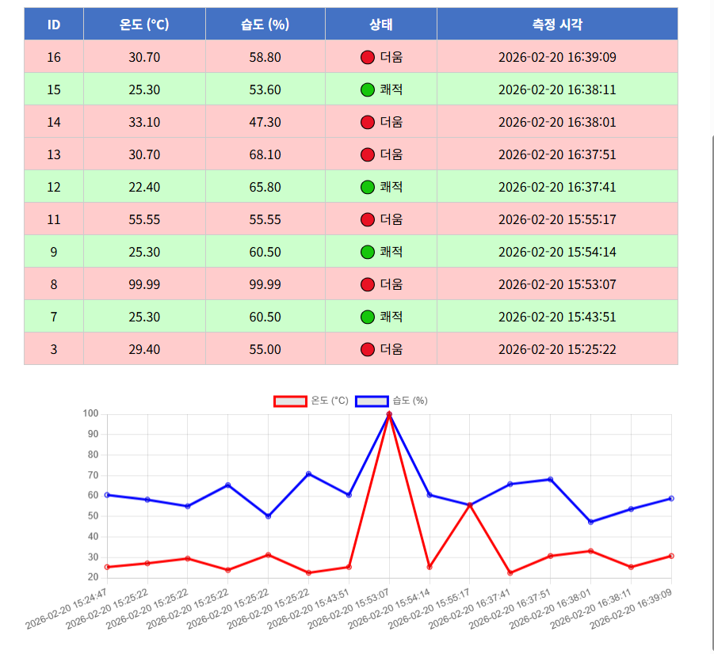

# 🌡️ Raspberry Pi IoT 센서 대시보드

Raspberry Pi + DHT11 센서 데이터를 Flask와 MariaDB로 저장하고 웹으로 표시하는 IoT 대시보드 프로젝트

## 📸 대시보드 미리보기



## 🛠 기술 스택

| 분류 | 기술 |
|------|------|
| 하드웨어 | Raspberry Pi, DHT11 센서 |
| 백엔드 | Python 3, Flask |
| 데이터베이스 | MariaDB, PyMySQL |
| 프론트엔드 | Jinja2, Chart.js |
| 통신 | pyserial (Arduino) |

## 📁 프로젝트 구조
```
raspberry-pi-project/
├── flask_sensor_app.py          # Flask 메인 앱 (센서 수집, DB 저장, 라우트)
├── flask_sensor_templates/
│   ├── index.html               # 메인 대시보드 (통계, 그래프, 경보)
│   └── analysis.html            # 시간대별 분석 페이지
├── db_test.py                   # PyMySQL DB 연결 테스트
├── images/
│   └── dashboard.png            # 대시보드 스크린샷
├── app.py                       # 트위터 클론 앱
├── templates/                   # 트위터 클론 템플릿
│   ├── base.html
│   ├── index.html
│   ├── hashtag.html
│   ├── trending.html
│   └── search.html
└── README.md
```

## ✨ 주요 기능

### 🌡️ IoT 센서 대시보드
- 온도/습도 실시간 수집 및 저장 (10초마다 자동 수집)
- Chart.js 꺾은선 그래프 시각화
- 온도 30°C 초과 시 경보 알림
- 온도별 행 색상 표시 (🔴더움 / 🟢쾌적 / 🔵추움)
- 평균/최고/최저 온도 통계 카드
- 시간대별 평균 온도 분석
- 100개 초과 시 오래된 데이터 자동 삭제

### 🐦 트위터 클론
- 회원가입/로그인
- 트윗 작성/삭제
- 팔로우/언팔로우
- 좋아요 기능
- 해시태그 검색
- DM 기능

### 🔌 미니터 REST API
- `GET /ping` 서버 상태 확인
- `POST /sign-up` 회원가입
- `POST /tweet` 트윗 작성
- `DELETE /tweet/<id>` 트윗 삭제
- `POST /follow` 팔로우
- `POST /unfollow` 언팔로우
- `GET /timeline` 타임라인 조회
- `GET /user/<id>` 유저 정보 조회
- `GET /users` 전체 유저 목록
- `PUT /user/<id>` 프로필 수정

## 🚀 실행 방법
```bash
# 의존성 설치
pip install flask pymysql pyserial

# 센서 대시보드 실행
python3 flask_sensor_app.py

# 브라우저 접속
http://라즈베리파이IP:5000
```

## 📡 페이지 목록

| 페이지 | URL | 설명 |
|--------|-----|------|
| 메인 대시보드 | `/` | 센서 데이터 표시 |
| 데이터 수집 | `/collect` | 수동 데이터 수집 |
| 시간대별 분석 | `/analysis` | 시간대별 평균 온도 |
| 그래프 API | `/api/chart` | JSON 데이터 반환 |

## 📚 수업 커리큘럼
```
1교시  Flask return 이해
2교시  Jinja2 템플릿으로 데이터 표시
3교시  Arduino → pyserial → Flask 연결
4교시  MariaDB 테이블 설계
5교시  SQL CRUD 직접 작성
6교시  Flask ↔ MariaDB 연결
7교시  전체 통합 (Arduino → DB → 웹)
8교시  심화 확장 (그래프, 경보, 분석)
```
